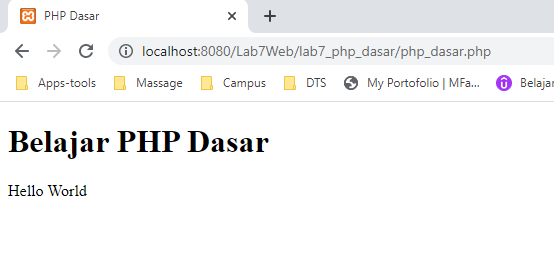
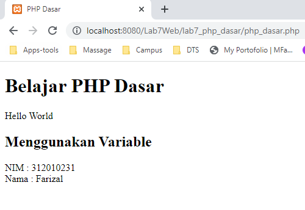
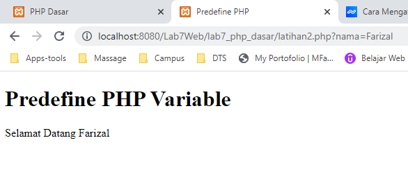
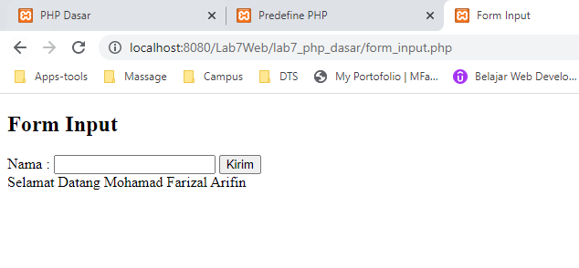
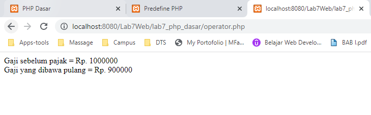
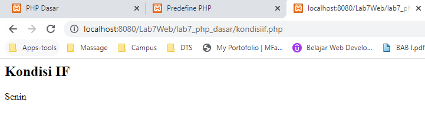
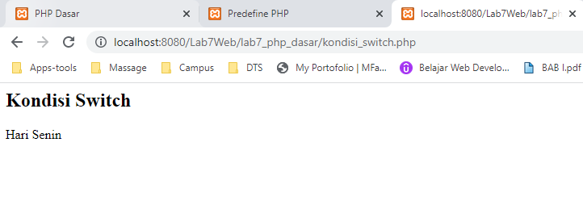
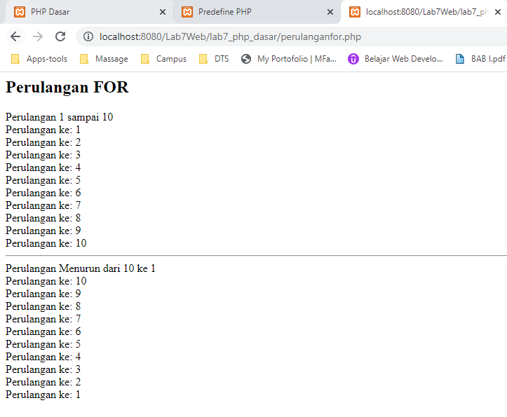
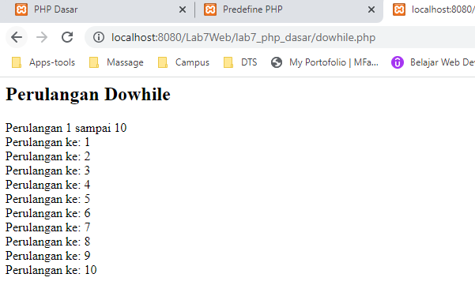
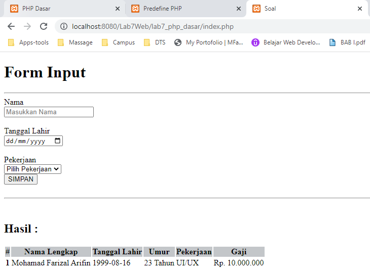

# Lab7Web

**Nama  : Mohamad Farizal Arifin**

**Nim   : 312010231**

**Kelas : TI.20.B.1**

<br>

**Langkah - langkah praktikum**<br>

1. Menjalankan aplikasi web server yang sudah diinstall disini menggunakan aplikasi XAMPP, dan akses folder direktory yang sudah dibuat pada direktory web server <br>
Berikut hasilnya :<br>

 <br>

2. Buat file baru dengan nama **php_dasar.php** pada directory tersebut. Kemudian buat kode seperti berikut.<br>

```
<!DOCTYPE html>
<html lang="en">
<head>
    <meta charset="UTF-8">
    <title>PHP Dasar</title>
</head>
<body>
    <h1>Belajar PHP Dasar</h1>
    <?php
        echo "Hello World";
    ?>
</body>
</html>
```
<br>

Kemudian untuk mengakses hasilnya melalui URL: *http://localhost:8080/Lab7Web/lab7_php_dasar/php_dasar.php*<br>
 <br>

**Menambahkan variable pada program**<br>
```
    <h2>Menggunakan Variable</h2>
    <?php
        $nim = "312010231";
        $nama = 'Farizal';
        echo "NIM : " . $nim . "<br>";
        echo "Nama : $nama";
    ?>
```
Berikut hasilnya :<br>

 <br>

**Predefine Variable $_GET**<br>
```
    <?php
        echo 'Selamat Datang ' . $_GET['nama'];
    ?>
```
Untuk mengaksesnya gunakan url : http://localhost:8080/Lab7Web/lab7_php_dasar/latihan2.php?nama=Farizal dan Berikut hasilnya :<br>

 <br>

**Membuat Form Input**<br>
```
<!DOCTYPE html>
<html lang="en">
<head>
    <meta charset="UTF-8">
    <title>Form Input</title>
</head>
<body>
<h2>Form Input</h2>
<form method="POST">
    <label>Nama : </label>
    <input type="text" name="nama">
    <input type="submit" value="Kirim">
</form>
    <?php
        echo 'Selamat Datang ' . $_POST['nama'];
    ?>
</body>
</html>
```
Berikut hasilnya :<br>

 <br>

**Operator PHP**<br>
```
<?php
    $gaji = 1000000;
    $pajak = 0.1;
    $thp = $gaji - ($gaji*$pajak);

    echo "Gaji sebelum pajak = Rp. $gaji <br>";
    echo "Gaji yang dibawa pulang = Rp. $thp";
?>
```
Berikut hasilnya :<br>

 <br>

**Kondisi IF**<br>
```
<h2>Kondisi IF</h2>

<?php
    $nama_hari = date("l");

    if ($nama_hari == "Sunday") {
        echo "Minggu";
    } elseif ($nama_hari == "Monday") {
        echo "Senin";
    } else {
        echo "Selasa";
    }
?>
```
Berikut hasilnya :<br>

 <br>

**Kondisi Switch**<br>
```
<h2>Kondisi Switch</h2>

<?php
    $nama_hari = date("l");
    switch ($nama_hari) {
        case "Sunday":
            echo "Hari Minggu";
            break;
        case "Monday":
            echo "Hari Senin";
            break;
        case "Tuesday":
            echo "Hari Selasa";
            break;
        default:
            echo "Hari Sabtu";
        }
?>
```
Berikut hasilnya :<br>

 <br>

**Perulangan For**<br>
```
<h2>Perulangan FOR</h2>

<?php
    echo "Perulangan 1 sampai 10 <br />";

    for ($i=1; $i<=10; $i++) {
        echo "Perulangan ke: " . $i . '<br />';
    }
    
    echo "<hr>";
    echo "Perulangan Menurun dari 10 ke 1 <br />";
    for ($i=10; $i>=1; $i--) {
        echo "Perulangan ke: " . $i . '<br />';
    }
?>
```
Berikut hasilnya :<br>

 <br>

**Perulangan While**<br>
```
<h2>Perulangan While</h2>

<?php
    echo "Perulangan 1 sampai 10 <br />";

    $i=1;
        while ($i<=10) {
            echo "Perulangan ke: " . $i . '<br />';
            $i++;
        }
?>
```
Berikut hasilnya :<br>

 <br>

**Perulangan Do While**<br>
```
<h2>Perulangan Dowhile</h2>

<?php
    echo "Perulangan 1 sampai 10 <br />";

    $i=1;
        do {
            echo "Perulangan ke: " . $i . '<br />';
            $i++;
        } while ($i<=10);
?>
```
Berikut hasilnya :<br>

 <br>

**Pertanyaan dan Tugas**<br>
Buatlah program PHP sederhana dengan menggunakan form input yang menampilkan nama, tanggal lahir dan pekerjaan. Kemudian tampilkan outputnya dengan menghitung umur berdasarkan inputan tanggal lahir. Dan pilihan pekerjaan dengan gaji yang berbeda-beda sesuai pilihan pekerjaan.

**Jawaban**
```
<!DOCTYPE html>
<html lang="en">
<head>
    <meta charset="UTF-8">
    <title>Soal</title>
</head>
<body>

    <div class="container">
        <div class="row">
            <div class="col-12 text-center">
                <h1><i class="fa fa-list"></i> Form Input</h1>
            </div>
        </div>
        <hr>

        <form method="POST" action="">

        <div class="row">
            <div class="col-sm-3">
                <label><i class="fa fa-user"></i> Nama</label>
            </div>
            <div class="col-sm-9">
                <input type="text" class="form-control" name="nama" placeholder="Masukkan Nama">
            </div>
        </div>
        <br>
        <div class="row">
            <div class="col-sm-3">
                <label><i class="fa fa-calendar"></i> Tanggal Lahir</label>
            </div>
            <div class="col-sm-5">
                <input type="date" class="form-control" name="tgllahir">
            </div>
        </div>
        <br>
        <div class="row">
            <div class="col-sm-3">
                <label><i class="fa fa-briefcase"></i> Pekerjaan</label>
            </div>
            <div class="col-sm-5">
                <select class="form-select form-control" name="pekerjaan">
                    <option value="kosong" selected>Pilih Pekerjaan</option>
                    <option value="frontend">Front End</option>
                    <option value="backend">Back End</option>
                    <option value="uiux">UI/UX</option>
                </select>
            </div>
        </div>
        <div class="row">
            <div class="col-sm-3">
                <button type="submit" name="simpan" class="btn btn-primary"><i class="fa fa-save"></i> SIMPAN</button>
            </div>
        </div>
        </form>

<?php
if(isset($_POST['simpan'])){
    $nama = $_POST['nama'];
    $tgllahir = $_POST['tgllahir'];
    $pekerjaan = $_POST['pekerjaan'];

    $pisahtgl = explode('-',$tgllahir);
        $tahunlahir = $pisahtgl[0];
        $bulan = $pisahtgl[1];
        $tgl = $pisahtgl[2];
    
    $tahunini = date('Y');
    $hitungumur = $tahunini - $tahunlahir;

    if($pekerjaan == 'kosong'){
        $kerja = "Anda tidak memilih pekerjaan";
        $gaji = 0;
    }else if($pekerjaan == 'frontend'){
        $kerja = "Front End";
        $gaji = "10.000.000";
    }else if($pekerjaan == 'backend'){
        $kerja = "Back End";
        $gaji = "9.000.000";
    }else if($pekerjaan == 'uiux'){
        $kerja = "UI/UX";
        $gaji = "10.000.000";
    }else{
        $kerja = "Anda tidak memilih pekerjaan / sedang tidak bekerja";
        $gaji = 0;
    }

    echo "<br><hr><br>";
    echo "<h2>Hasil : </h2>\n";
    echo '<table class="table table-hover table-bordered">
                <thead style="background-color: #c3c6c9">
                    <tr class="text-center">
                        <th>#</th>
                        <th>Nama Lengkap</th>
                        <th>Tanggal Lahir</th>
                        <th>Umur</th>
                        <th>Pekerjaan</th>
                        <th>Gaji</th>
                    </tr>
                </thead>
                <tbody>
                    <tr>
                        <th scope="row">1</th>
                        <td>'.$nama.'</td>
                        <td>'.$tgllahir.'</td>
                        <td>'.$hitungumur.' Tahun</td>
                        <td>'.$kerja.'</td>
                        <td>Rp. '.$gaji.'</td>
                    </tr>
                </tbody>
            </table>';

}
?>
</div>
</body>
</html>
```

Berikut hasilnya :<br>

 <br>
