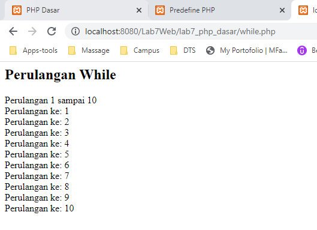

# Lab7Web

**Nama  : Mohamad Farizal Arifin**

**Nim   : 312010231**

**Kelas : TI.20.B.1**

<br>

**Langkah - langkah praktikum**<br>

1. Menjalankan aplikasi web server yang sudah diinstall disini menggunakan aplikasi XAMPP, dan akses folder direktory yang sudah dibuat pada direktory web server <br>
Berikut hasilnya :<br>

 <br>

2. Buat file baru dengan nama **php_dasar.php** pada directory tersebut. Kemudian buat kode seperti berikut.<br>

```
<!DOCTYPE html>
<html lang="en">
<head>
    <meta charset="UTF-8">
    <title>PHP Dasar</title>
</head>
<body>
    <h1>Belajar PHP Dasar</h1>
    <?php
        echo "Hello World";
    ?>
</body>
</html>
```
<br>

Kemudian untuk mengakses hasilnya melalui URL: *http://localhost:8080/Lab7Web/lab7_php_dasar/php_dasar.php*<br>
 <br>

**Menambahkan variable pada program**<br>
```
    <h2>Menggunakan Variable</h2>
    <?php
        $nim = "312010231";
        $nama = 'Farizal';
        echo "NIM : " . $nim . "<br>";
        echo "Nama : $nama";
    ?>
```
Berikut hasilnya :<br>

 <br>

**Predefine Variable $_GET**<br>
```
    <?php
        echo 'Selamat Datang ' . $_GET['nama'];
    ?>
```
Untuk mengaksesnya gunakan url : http://localhost:8080/Lab7Web/lab7_php_dasar/latihan2.php?nama=Farizal dan Berikut hasilnya :<br>

 <br>

**Membuat Form Input**<br>
```
<!DOCTYPE html>
<html lang="en">
<head>
    <meta charset="UTF-8">
    <title>Form Input</title>
</head>
<body>
<h2>Form Input</h2>
<form method="POST">
    <label>Nama : </label>
    <input type="text" name="nama">
    <input type="submit" value="Kirim">
</form>
    <?php
        echo 'Selamat Datang ' . $_POST['nama'];
    ?>
</body>
</html>
```
Berikut hasilnya :<br>

 <br>

**Operator PHP**<br>
```
<?php
    $gaji = 1000000;
    $pajak = 0.1;
    $thp = $gaji - ($gaji*$pajak);

    echo "Gaji sebelum pajak = Rp. $gaji <br>";
    echo "Gaji yang dibawa pulang = Rp. $thp";
?>
```
Berikut hasilnya :<br>

 <br>

**Kondisi IF**<br>
```
<h2>Kondisi IF</h2>

<?php
    $nama_hari = date("l");

    if ($nama_hari == "Sunday") {
        echo "Minggu";
    } elseif ($nama_hari == "Monday") {
        echo "Senin";
    } else {
        echo "Selasa";
    }
?>
```
Berikut hasilnya :<br>

 <br>

**Kondisi Switch**<br>
```
<h2>Kondisi Switch</h2>

<?php
    $nama_hari = date("l");
    switch ($nama_hari) {
        case "Sunday":
            echo "Hari Minggu";
            break;
        case "Monday":
            echo "Hari Senin";
            break;
        case "Tuesday":
            echo "Hari Selasa";
            break;
        default:
            echo "Hari Sabtu";
        }
?>
```
Berikut hasilnya :<br>

 <br>

**Perulangan For**<br>
```
<h2>Perulangan FOR</h2>

<?php
    echo "Perulangan 1 sampai 10 <br />";

    for ($i=1; $i<=10; $i++) {
        echo "Perulangan ke: " . $i . '<br />';
    }
    
    echo "<hr>";
    echo "Perulangan Menurun dari 10 ke 1 <br />";
    for ($i=10; $i>=1; $i--) {
        echo "Perulangan ke: " . $i . '<br />';
    }
?>
```
Berikut hasilnya :<br>

 <br>

**Perulangan While**<br>
```
<h2>Perulangan While</h2>

<?php
    echo "Perulangan 1 sampai 10 <br />";

    $i=1;
        while ($i<=10) {
            echo "Perulangan ke: " . $i . '<br />';
            $i++;
        }
?>
```
Berikut hasilnya :<br>

 <br>